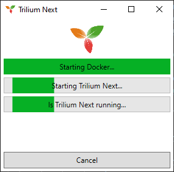

# DockerAppStarter

The purpose of this app is to create nicely looking startup windows from shortcuts for docker apps.



## How to use

You can use this app in 2 way, using startup args or json file.

In both cases you need to create a shortcut to the `DockerAppStarter` executable.

### Startup args

As for now, following arguments are supported:

| Argument | Name | Description |
| -------- | ---- | ----------- |
| -s | Stack | This argument is optional. This is stack of your services. |
| -sv | Service | Single service within stack. |
| -i | Image | Image that will be shown in the starter window. |
| -d | Dependency | The name of the service within same stack that main service depends upon. |

### Json file

You can create `json` file and reference it by `-f` startup argument, like this:

```
-f C:\Absolute\Path\To\File.json
```

Example file

```json
{
	"WindowTitle": "Ghost",
	"DisplayName": "Ghost",
	"Stack": "local-apps",
	"Service": "ghost-1",
	"ImageFilePath": "D:\\data\\DockerAppStarter\\ghost.png",
	"IconFilePath": "D:\\data\\DockerAppStarter\\ghost.ico",
	"RestartCompose": false,
	"ComposeFilePath": "D:\\dev\\docker\\compose\\ghost\\docker-compose.yml",
	"Dependencies": [
		{
			"WindowTitle": "Ghost DB",
			"DisplayName": "Ghost DB",
			"Stack": "local-apps",
			"Service": "ghost_db-1",
			"ImageFilePath": "D:\\data\\DockerAppStarter\\ghost.png",
			"IconFilePath": "D:\\data\\DockerAppStarter\\ghost.ico",
			"Dependencies": []
		}
	]
}
```

The properties are as follow:

| Key | Description |
| ---- | ----------- |
| WindowTitle | This will be shown as window title. |
| DisplayName | This will be shown as service name. |
| Stack | This is stack of your services. This value is optional. |
| Service | Single service within stack. |
| ImageFilePath | Path to the image that will be shown. |
| IconFilePath | Path to icon that will be shown wihin app title bar. |
| RestartCompose | Determiens whether full docker compose restart should be performed when starting the app. |
| ComposeFilePath | Absolute file path to related compose file. |
| Dependencies | Collection of dependencies. Each element has same structure. |

## Limitations

As for now, only 1 level of dependencies is supported. If need for more occur, then the implementation will happen.

D:\run\DockerAppStarter\DockerAppStarter.Gui.exe -s local-apps -sv trilium-1 -i D:\data\DockerAppStarter\trilium-next.png
